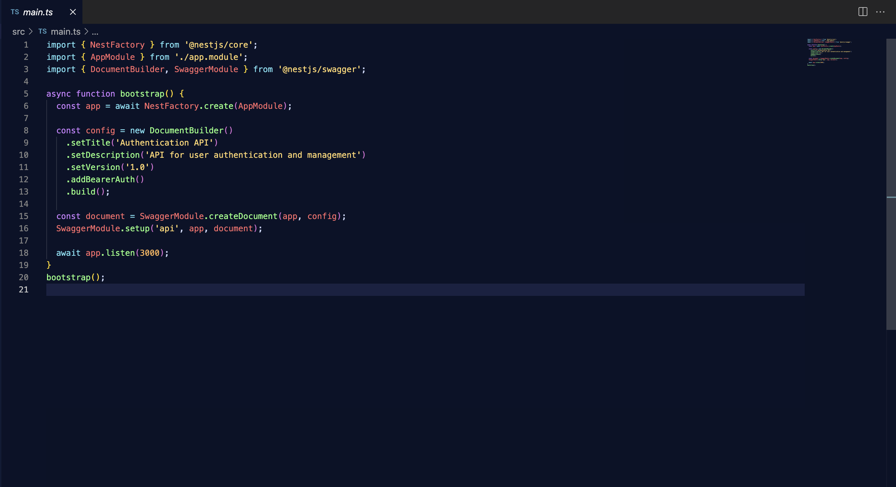
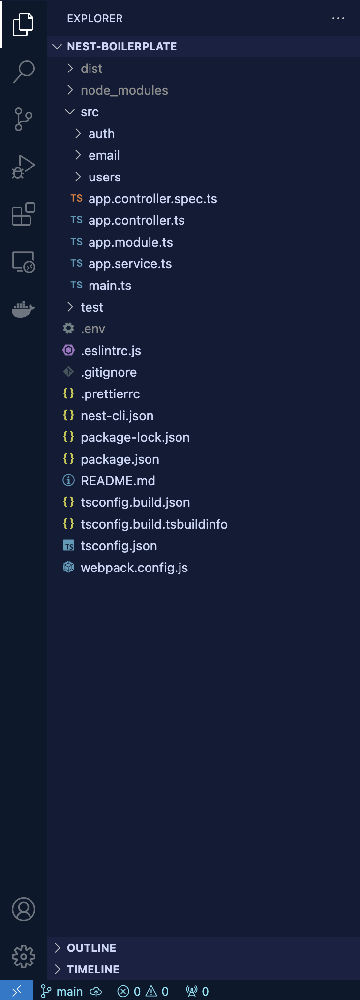
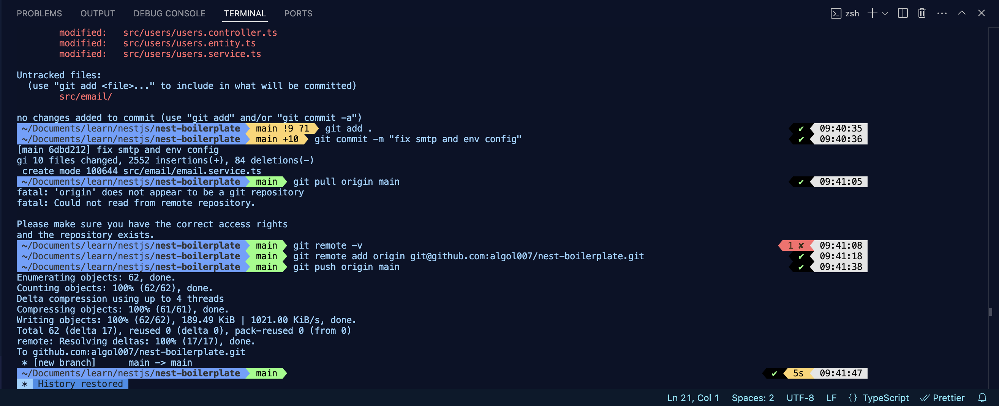

# Aurora Pulse

_Aurora Pulse_ is a beautifully crafted dark theme for Visual Studio Code, inspired by the mesmerizing colors of the northern lights. With vibrant, neon highlights and deep, cosmic tones, this theme offers a balance between aesthetics and readability, making your coding experience both visually pleasing and productive.

## 🌌 Key Features

- **Vibrant Neon Colors**: Inspired by the aurora borealis, this theme features neon blues, greens, and purples that stand out against a dark background.
- **Readable Contrast**: Thoughtfully chosen color contrasts to reduce eye strain and ensure code clarity.
- **Consistent Design**: Uniform and cohesive color palette across all editor elements, making the theme feel harmonious and polished.
- **Supported Languages**: Optimized for a wide range of languages and frameworks like JavaScript, TypeScript, Python, HTML, CSS, and more.
- **Minimal Distractions**: A clean, distraction-free experience without sacrificing functionality.

## 🎨 Color Palette

| Element              | Color       |
| -------------------- | ----------- |
| Background           | `#0b1228`   |
| Foreground (Text)    | `#cbd6f7`   |
| Selection Background | `#5aa8de66` |
| Keyword              | `#79e3f7`   |
| String               | `#ffd56b`   |
| Function             | `#8aff80`   |
| Variable             | `#ff6a6a`   |
| Comment              | `#526077`   |

These colors are carefully curated to enhance code readability while giving a fresh, energetic feel to your workspace.

## 📸 Screenshots

### Code Preview

### Sidebar and File Explorer

### Terminal

## 🚀 Installation

1. Open **Visual Studio Code**.
2. Go to the **Extensions** view by clicking on the Extensions icon in the Activity Bar on the side of the window or use the keyboard shortcut `Ctrl+Shift+X`.
3. Search for `Aurora Pulse`.
4. Click **Install** to install the theme.
5. Once installed, open the Command Palette (`Ctrl+Shift+P`) and type `Preferences: Color Theme`, then select **Aurora Pulse** from the list.

## 📝 License

This theme is licensed under the [MIT License](https://github.com/algol007/aurora-pulse/LICENSE.md).
